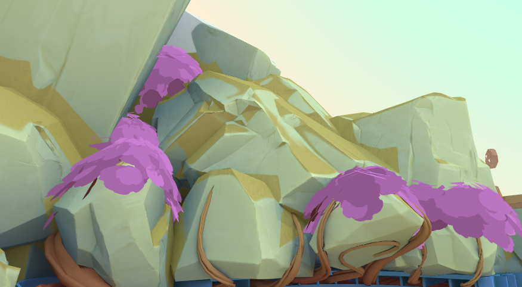
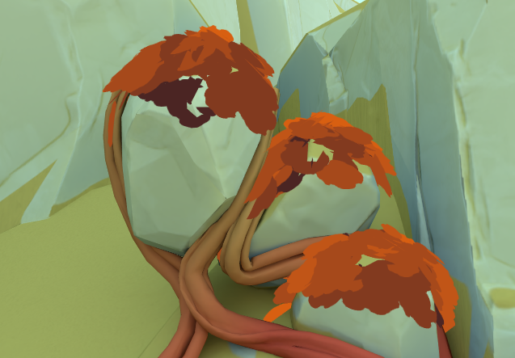
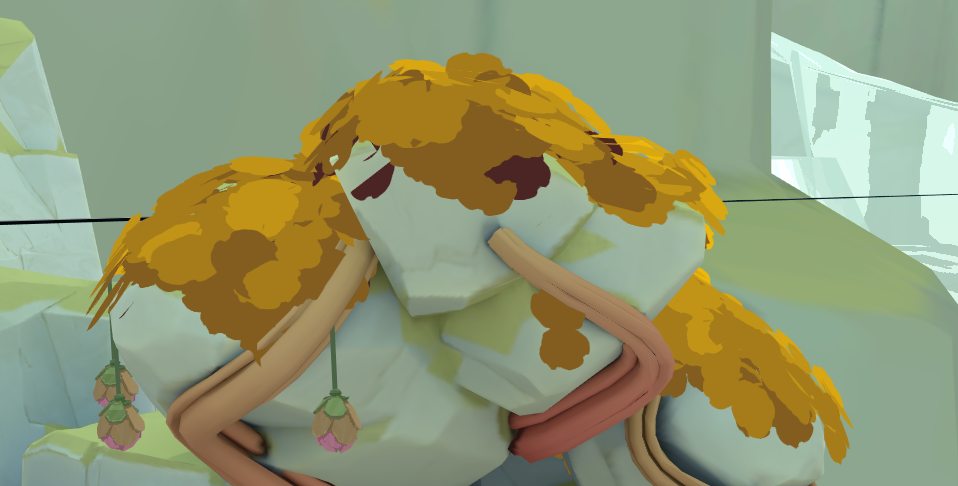
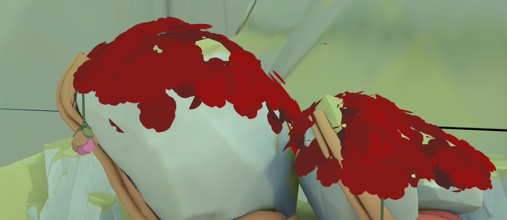
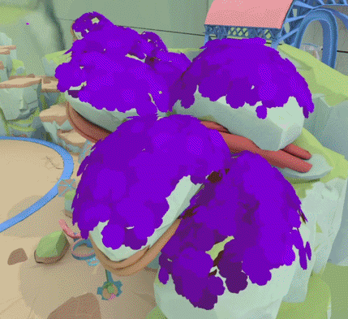
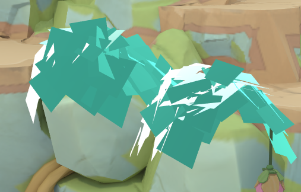

# How to install
1. Install MelonLoader
2. Run Game
3. Drop Mods Folder into Rumble Folder
4. Play Game.

# Current Presets (Colours + Materials)
### Cherry

### Orange

### Yellow

### Red

### RAINBOW

### Shiftstones

### Random
No image because it's the other stuff but you don't know which

 

# Help And Other Resources
Get help and find other resources in the Modding Discord:
https://discord.gg/fsbcnZgzfa